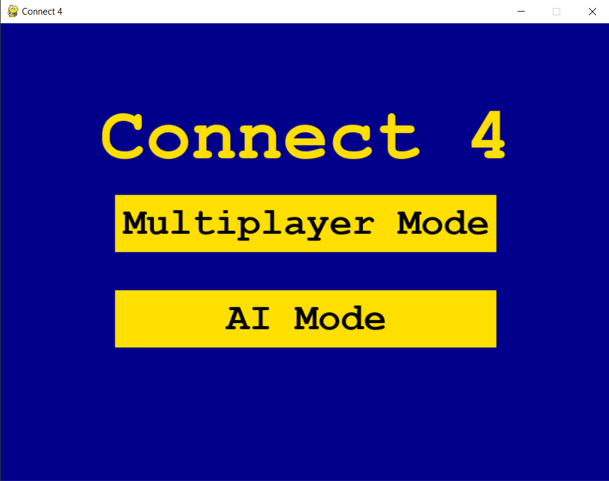
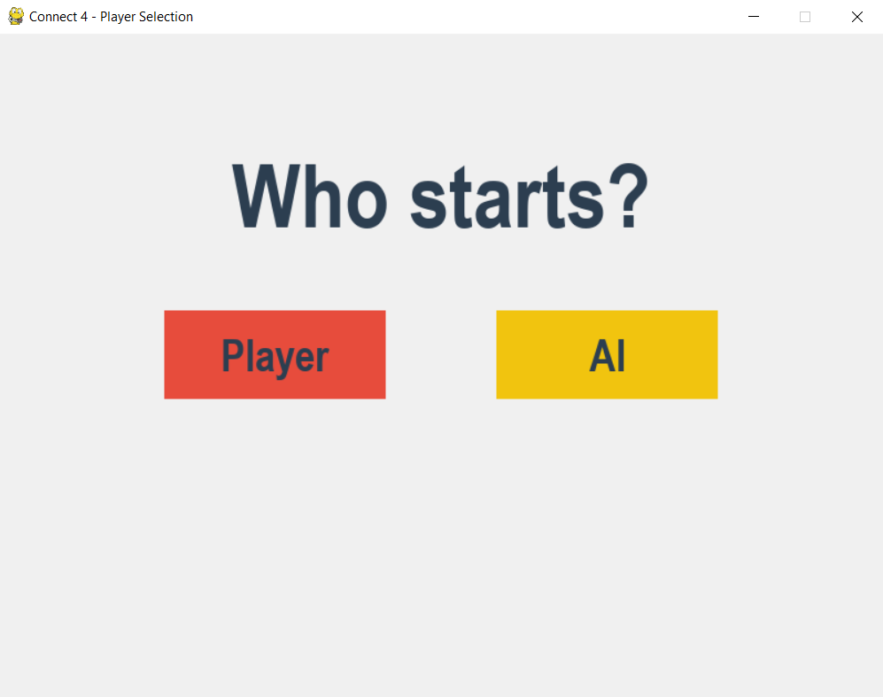
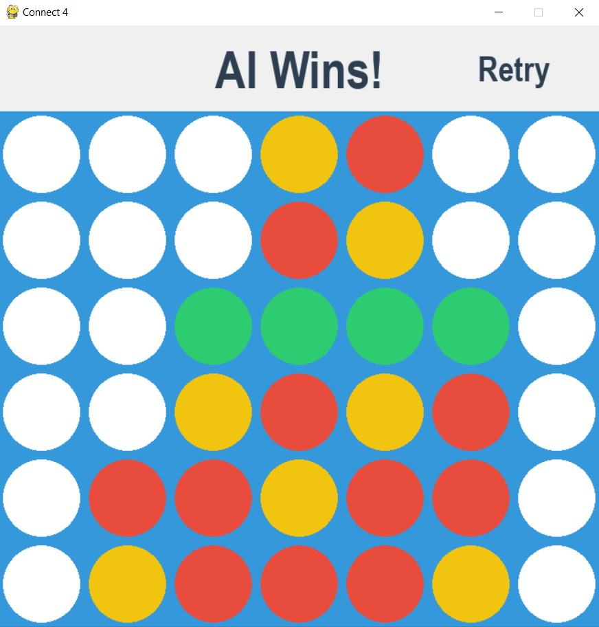

# Connect4-AI

This is a Connect 4 AI that you can play against. It is based on Pascal Pons' algorithm but implemented in Python instead of the original C++.

## Features
- MinMax algorithm
- Alpha-beta pruning
- Move exploration order optimization
- Bitboard representation
- Transposition table for caching
- Iterative deepening
- Anticipation of losing moves

For more details on the original algorithm, visit: [Pascal Pons' blog](http://blog.gamesolver.org/solving-connect-four/01-introduction/)

## Screenshots

### Main Menu

### Player Selection

### AI Wins

